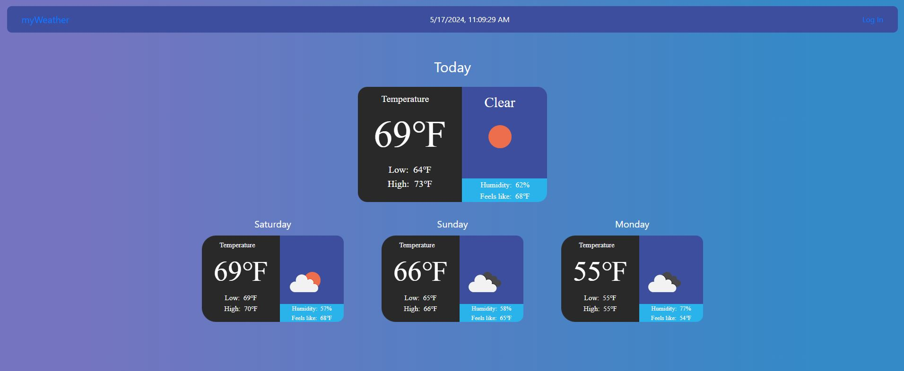
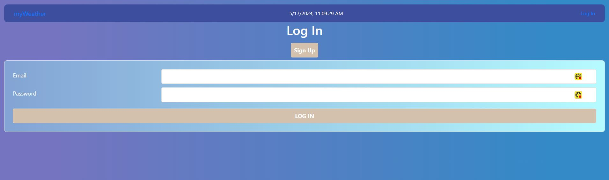
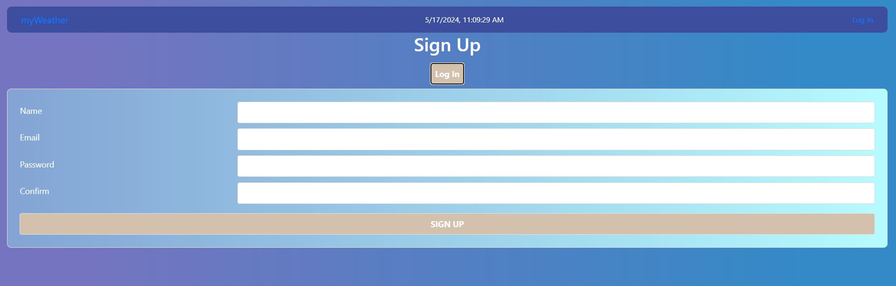

# 🌤️ myWeather App

A modern, responsive weather application that provides real-time weather data and 3-day forecasts based on your location. Built with the MERN stack and integrated with the OpenWeather API.

[](https://sei-myweather-957e9e461786.herokuapp.com/)
[](LICENSE)

## 📱 Screenshots

<div align="center">
  
  
  
</div>

## ✨ Features

### 🌍 **Smart Location Detection**
- **GPS Location**: Automatic location detection using browser geolocation
- **IP-based Fallback**: Secondary location detection via IP address
- **Manual Controls**: Three location options (GPS, IP, NYC default)
- **Real-time Coordinates**: Display current latitude/longitude being used

### 🌦️ **Weather Information**
- **Current Weather**: Real-time temperature, weather conditions, humidity, and "feels like" temperature
- **3-Day Forecast**: Extended weather predictions with daily highs and lows
- **Weather Icons**: Visual weather condition indicators from OpenWeather API
- **Imperial Units**: Temperature displayed in Fahrenheit

### 👤 **User Authentication**
- **Secure Login/Signup**: JWT-based authentication system
- **User Sessions**: Persistent login sessions
- **Protected Routes**: Access control for authenticated users

### 🎨 **User Experience**
- **Responsive Design**: Works seamlessly across desktop, tablet, and mobile
- **Live Time Display**: Auto-updating navbar clock (updates every minute)
- **Smart Error Handling**: Graceful fallbacks and user-friendly error messages
- **Color-coded Status**: Visual feedback for different message types
- **Clean UI**: Modern, intuitive interface with proper spacing

## 🛠️ Technologies Used

### **Frontend**
- **React 18** - Component-based UI library
- **React Router DOM** - Client-side routing
- **CSS3** - Custom styling with responsive design
- **Bootstrap** - Grid system and components

### **Backend**
- **Node.js** - JavaScript runtime environment
- **Express.js** - Web application framework
- **MongoDB** - NoSQL database
- **Mongoose** - MongoDB object modeling

### **Authentication & Security**
- **JWT (jsonwebtoken)** - Secure token-based authentication
- **bcrypt** - Password hashing and verification

### **External APIs**
- **OpenWeather API** - Weather data and forecasts

### **Deployment**
- **Fly.io** - Container-based cloud deployment
- **Docker** - Image build and runtime packaging
- **MongoDB Atlas** - Managed cloud MongoDB hosting

## 🌐 Live Demo

Visit the live application: _Coming soon on Fly.io_

## 📂 Project Structure

```
myWeather/
├── public/                 # Static assets
├── src/
│   ├── components/        # Reusable React components
│   │   ├── DayOneTemp/    # Day 1 forecast card
│   │   ├── DayTwoTemp/    # Day 2 forecast card
│   │   ├── DayThreeTemp/  # Day 3 forecast card
│   │   ├── LocTempCard/   # Current weather display
│   │   ├── LoginForm/     # User login form
│   │   ├── SignUpForm/    # User registration form
│   │   └── NavBar/        # Navigation with live time
│   ├── pages/             # Page components
│   │   ├── App/           # Main application wrapper
│   │   ├── AuthPage/      # Authentication page
│   │   └── MyWeather/     # Weather dashboard
│   └── utilities/         # Helper functions and services
├── controllers/           # Express route controllers
├── models/                # Mongoose data models
├── config/                # Database and middleware config
├── routes/                # API route definitions
└── server.js              # Express server entry point
```

## 🔧 Key Features Implementation

### **Location Handling**
```javascript
// Smart fallback chain: GPS → IP → NYC Default
useEffect(() => {
  async function getCoords() {
    try {
      const coords = await locService.getLocation(); // GPS
      setCoords(coords);
    } catch (error) {
      const defaultCoords = locService.getDefaultLocation(); // NYC Default
      setCoords(defaultCoords);
    }
  }
}, []);
```

### **Live Time Updates**
```javascript
// Updates every minute without API calls
useEffect(() => {
  const timeInterval = setInterval(() => {
    setCurrentTime(new Date());
  }, 60000);
  return () => clearInterval(timeInterval);
}, []);
```

## 🔄 API Endpoints

### **Weather Routes**
- `GET /api/weather/lat/:lat/lon/:lon` - Current weather data
- `GET /api/forecast/lat/:lat/lon/:lon` - 3-day forecast data

### **User Routes**
- `POST /api/users` - User registration
- `POST /api/users/login` - User authentication
- `GET /api/users/check-token` - Token validation

## 🎯 Future Enhancements

- [ ] **User Profiles**: Personalized weather preferences and saved locations
- [ ] **Extended Forecasts**: 7-day and hourly weather predictions
- [ ] **Weather Alerts**: Push notifications for severe weather conditions
- [ ] **Multiple Locations**: Save and switch between favorite locations
- [ ] **Dark Mode**: Toggle between light and dark themes
- [ ] **Weather Maps**: Interactive weather radar and satellite imagery
- [ ] **Historical Data**: Past weather trends and comparisons
- [ ] **Mobile App**: Native iOS and Android applications

## 🐳 Docker Setup

This repository includes:
- `Dockerfile` for production image builds
- `docker-compose.yml` for local app + MongoDB development
- `.env.example` for required environment variables

### Local development with Docker Compose

1. Copy env template:

```bash
Copy-Item .env.example .env
```

2. Build and run:

```bash
docker compose up --build
```

3. App URL:
- `http://localhost:3001`

The compose file starts a local MongoDB container and points `DATABASE_URL` to it.

## 🚀 Fly.io Deployment

This app is MongoDB/Mongoose-based, so in production you should use a managed MongoDB endpoint (for example MongoDB Atlas) and provide its connection string as `DATABASE_URL`.

### Prerequisites

1. Install and authenticate Fly CLI:

```bash
fly auth login
```

2. Update app name in `fly.toml`:
- Set `app = "myweather-app"` to a globally unique name.

1. Set required secrets:

```bash
fly secrets set DATABASE_URL="mongodb+srv://..."
fly secrets set JWT_SECRET="your_long_random_secret"
fly secrets set OPENWEATHER_API_KEY="..."
```

### Deploy

```bash
fly launch --no-deploy
fly deploy
```

### Verify

```bash
fly status
fly logs
```


## 📄 License

This project is licensed under the MIT License - see the [LICENSE](LICENSE) file for details.

## 🙏 Acknowledgments

- [OpenWeather API](https://openweathermap.org/api) for weather data
- Weather icons and design inspiration from the development community

## 📞 Contact

**Developer**: awm.builds  
**GitHub**: [awm-builds](https://github.com/awm-builds)  
**Live Demo**: [myWeather App](https://awm-myweather-2026.fly.dev)

---

<div align="center">
  <p>Built with ❤️ using the MERN Stack</p>
  <p>🌤️ Stay updated with myWeather! 🌤️</p>
</div>
