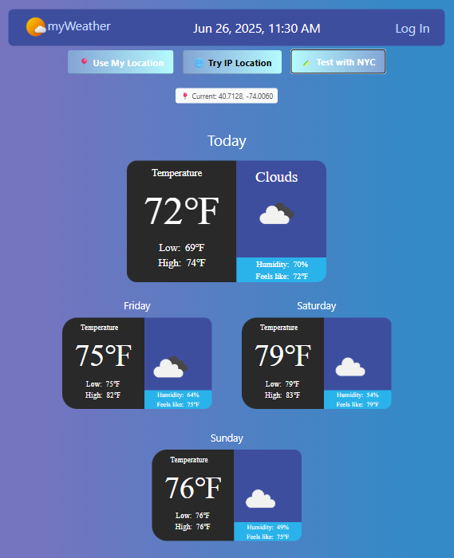
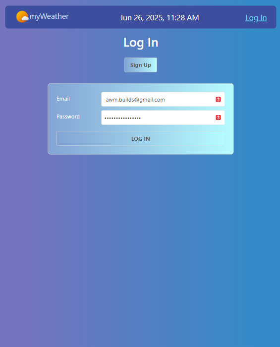
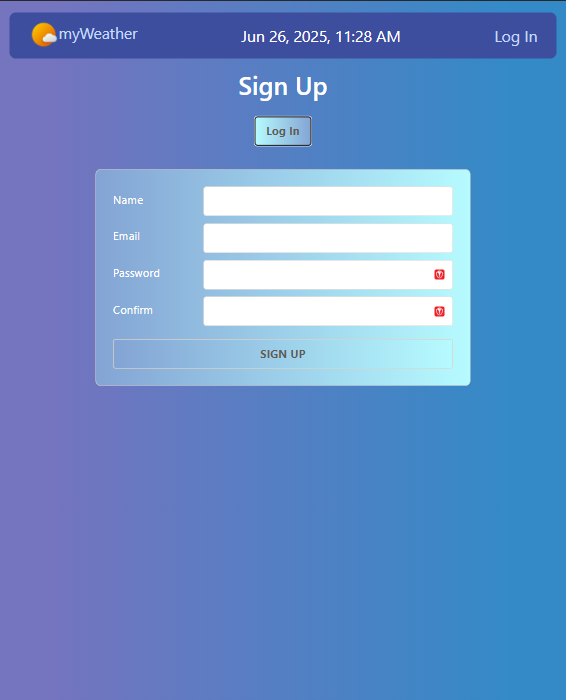

# 🌤️ myWeather App

A modern, responsive weather application that provides real-time weather data and 3-day forecasts based on your location. Built with the MERN stack and integrated with the OpenWeather API.

[](https://sei-myweather-957e9e461786.herokuapp.com/)
[](LICENSE)

## 📱 Screenshots

<div align="center">
  
  
  
</div>

## ✨ Features

### 🌍 **Smart Location Detection**
- **GPS Location**: Automatic location detection using browser geolocation
- **IP-based Fallback**: Secondary location detection via IP address
- **Manual Controls**: Three location options (GPS, IP, NYC default)
- **Real-time Coordinates**: Display current latitude/longitude being used

### 🌦️ **Weather Information**
- **Current Weather**: Real-time temperature, conditions, humidity, and "feels like" temperature
- **3-Day Forecast**: Extended weather predictions with daily highs and lows
- **Weather Icons**: Visual weather condition indicators from OpenWeather API
- **Imperial Units**: Temperature displayed in Fahrenheit

### 👤 **User Authentication**
- **Secure Login/Signup**: JWT-based authentication system
- **User Sessions**: Persistent login sessions
- **Protected Routes**: Access control for authenticated users

### 🎨 **User Experience**
- **Responsive Design**: Works seamlessly across desktop, tablet, and mobile
- **Live Time Display**: Auto-updating navbar clock (updates every minute)
- **Smart Error Handling**: Graceful fallbacks and user-friendly error messages
- **Color-coded Status**: Visual feedback for different message types
- **Clean UI**: Modern, intuitive interface with proper spacing

## 🛠️ Technologies Used

### **Frontend**
- **React 18** - Component-based UI library
- **React Router DOM** - Client-side routing
- **CSS3** - Custom styling with responsive design
- **Bootstrap** - Grid system and components

### **Backend**
- **Node.js** - JavaScript runtime environment
- **Express.js** - Web application framework
- **MongoDB** - NoSQL database
- **Mongoose** - MongoDB object modeling

### **Authentication & Security**
- **JWT (jsonwebtoken)** - Secure token-based authentication
- **bcrypt** - Password hashing and verification

### **External APIs**
- **OpenWeather API** - Weather data and forecasts
- **IP Geolocation API** - Location detection via IP address

### **Deployment**
- **Heroku** - Cloud platform deployment
- **MongoDB Atlas** - Cloud database hosting

## 🚀 Getting Started

### **Prerequisites**
- Node.js (v14 or higher)
- MongoDB (local or Atlas)
- OpenWeather API key

### **Installation**

1. **Clone the repository**
   ```bash
   git clone https://github.com/yourusername/myWeather.git
   cd myWeather
   ```

2. **Install dependencies**
   ```bash
   npm install
   ```

3. **Environment Setup**
   Create a `.env` file in the root directory:
   ```env
   DATABASE_URL=your_mongodb_connection_string
   SECRET=your_jwt_secret_key
   API_KEY=your_openweather_api_key
   ```

4. **Build the React app**
   ```bash
   npm run build
   ```

5. **Start the application**
   ```bash
   npm start
   ```

6. **Access the app**
   Open [http://localhost:3001](http://localhost:3001) in your browser

## 🌐 Live Demo

Visit the live application: [myWeather App](https://sei-myweather-957e9e461786.herokuapp.com/)

## 📂 Project Structure

```
myWeather/
├── public/                 # Static assets
├── src/
│   ├── components/        # Reusable React components
│   │   ├── DayOneTemp/    # Day 1 forecast card
│   │   ├── DayTwoTemp/    # Day 2 forecast card
│   │   ├── DayThreeTemp/  # Day 3 forecast card
│   │   ├── LocTempCard/   # Current weather display
│   │   ├── LoginForm/     # User login form
│   │   ├── SignUpForm/    # User registration form
│   │   └── NavBar/        # Navigation with live time
│   ├── pages/             # Page components
│   │   ├── App/           # Main application wrapper
│   │   ├── AuthPage/      # Authentication page
│   │   └── MyWeather/     # Weather dashboard
│   └── utilities/         # Helper functions and services
├── controllers/           # Express route controllers
├── models/               # Mongoose data models
├── config/               # Database and middleware config
├── routes/               # API route definitions
└── server.js             # Express server entry point
```

## 🔧 Key Features Implementation

### **Location Handling**
```javascript
// Smart fallback chain: GPS → IP → NYC Default
useEffect(() => {
  async function getCoords() {
    try {
      const coords = await locService.getLocation(); // GPS
      setCoords(coords);
    } catch (error) {
      try {
        const ipCoords = await locService.getLocationByIP(); // IP Fallback
        setCoords({ lat: ipCoords.lat, lon: ipCoords.lon });
      } catch (ipError) {
        const defaultCoords = locService.getDefaultLocation(); // NYC Default
        setCoords(defaultCoords);
      }
    }
  }
}, []);
```

### **Live Time Updates**
```javascript
// Updates every minute without API calls
useEffect(() => {
  const timeInterval = setInterval(() => {
    setCurrentTime(new Date());
  }, 60000);
  return () => clearInterval(timeInterval);
}, []);
```

## 🔄 API Endpoints

### **Weather Routes**
- `GET /api/weather/lat/:lat/lon/:lon` - Current weather data
- `GET /api/forecast/lat/:lat/lon/:lon` - 3-day forecast data

### **User Routes**
- `POST /api/users` - User registration
- `POST /api/users/login` - User authentication
- `GET /api/users/check-token` - Token validation

## 🎯 Future Enhancements

- [ ] **User Profiles**: Personalized weather preferences and saved locations
- [ ] **Extended Forecasts**: 7-day and hourly weather predictions
- [ ] **Weather Alerts**: Push notifications for severe weather conditions
- [ ] **Multiple Locations**: Save and switch between favorite locations
- [ ] **Dark Mode**: Toggle between light and dark themes
- [ ] **Weather Maps**: Interactive weather radar and satellite imagery
- [ ] **Historical Data**: Past weather trends and comparisons
- [ ] **Mobile App**: Native iOS and Android applications

## 🤝 Contributing

1. Fork the repository
2. Create a feature branch (`git checkout -b feature/amazing-feature`)
3. Commit your changes (`git commit -m 'Add amazing feature'`)
4. Push to the branch (`git push origin feature/amazing-feature`)
5. Open a Pull Request

## 📄 License

This project is licensed under the MIT License - see the [LICENSE](LICENSE) file for details.

## 🙏 Acknowledgments

- [OpenWeather API](https://openweathermap.org/api) for weather data
- [General Assembly](https://generalassemb.ly/) for project guidance
- Weather icons and design inspiration from the development community

## 📞 Contact

**Developer**: [Your Name]  
**Email**: [your.email@example.com]  
**GitHub**: [@yourusername](https://github.com/yourusername)  
**Live Demo**: [myWeather App](https://sei-myweather-957e9e461786.herokuapp.com/)

---

<div align="center">
  <p>Built with ❤️ using the MERN Stack</p>
  <p>🌤️ Stay updated with myWeather! 🌤️</p>
</div>